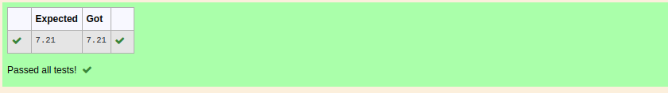

# DISTANCE-BETWEEN-TWO-POINTS

## AIM:
To write a python program to find the distance two 2 points
## ALGORITHM:
### Step 1: 
### Step 2: 
### Step 3: 
Substitute the values in the distance formula  
### Step 4: 
### Step 5: 
### PROGRAM:
 import math
x1,x2,y1,y2=10,4,6,2
dist=math.sqrt((x2-x1)**2+(y2-y1)**2)
print("{:.2f}".format(dist)) 

### OUTPUT:

### RESULT:
Thus the distance between two points succesfully executed.